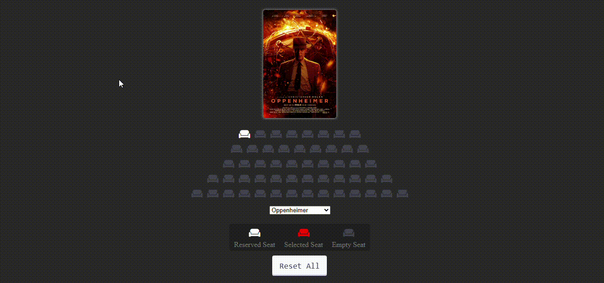

# CinemaTicketReservation

<h2>Cinema Ticket Reservation Project</h2>

This project is created with HTML, HTML5, CSS, CSS3 and JavaScript. It is an example of cinema ticket reservation system. User can select the any seats, depends on the movie selection price changes. 

<h2>Technologies</h2>

-HTML -HTML5 -CSS -CSS3 -JavaScript -FontAwesome

<h2>Project Gif</h2>

You can see the project from this link: https://cinematicketreservationjs.netlify.app

